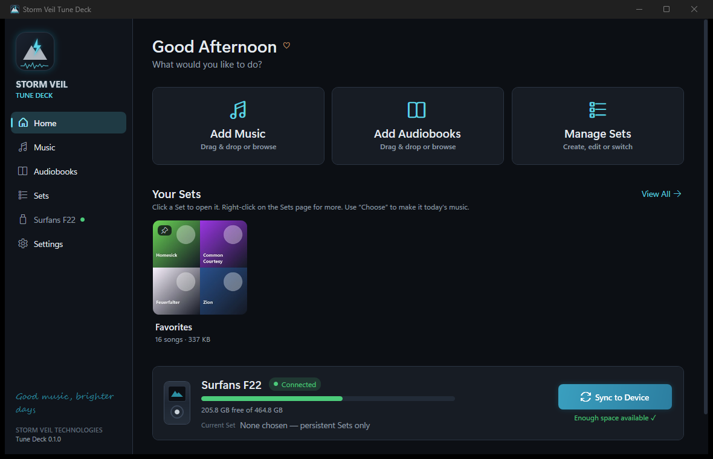

# Storm Veil Tune Deck

**A simple way to fill your music player with the right music.**

Tune Deck is a Windows app for people who love their music but not their computers. It keeps your songs and audiobooks in one tidy library, lets you build **Sets** (think cassette cases: *Screamo*, *Techno*, *Chill*, *Road Trip*, *Worship*…), and puts the Set you want on your **Surfans F22** MP3 player with one click. Switching from "Screamo today" to "Techno today" is a sync, not an afternoon of copying folders.

## Install

1. Download **`StormVeil.TuneDeck-win-Setup.exe`** from the [latest release](https://github.com/Storm-Veil-Technology/Tune-Deck-Releases/releases/latest).
2. Run it. No admin rights, nothing else to install. A shortcut appears on your desktop and Start menu.
3. Tune Deck opens with a short welcome: point it at your music (or add music later), plug in the F22, done.

Once installed, Tune Deck **updates itself**: it checks quietly for new versions and installs them the next time you open it.

Windows 10 or 11, 64-bit.

## What it does

- **Add music and audiobooks** by drag-and-drop or browsing. Tags and cover art are read for you; nothing is re-encoded.
- **Sets** hold whole artists, albums or genres as well as single songs, so new music by an artist you've included joins the Set on its own. A song can live in many Sets without extra copies.
- **Always keep on player** pins Sets like *Favorites* or your audiobooks so they stay on the F22 while you switch music Sets.
- **Sync to Device** copies only what changed, removes only what Tune Deck put there, and writes playlists the player can browse. If the cable gets pulled mid-sync, plug it back in and it carries on.
- **Backups** copy your whole library, or everything on the player, to a drive or folder. Run them any time; nothing is ever deleted from a backup.
- **Format conversion** turns songs the player can't play into MP3 (or FLAC) at sync time, keeping the originals untouched.
- **Plain language everywhere.** "Your F22 is connected." "Adding 42 songs." "Your music is ready." The technical bits stay under *Advanced*.

## Release notes

Every version has its notes under [`notes/`](notes) and in the [changelog](CHANGELOG.md).

## About

Made by Storm Veil Technologies. This repository publishes installers and release notes; the application itself is developed privately.

_Different days, different sounds, same you._
